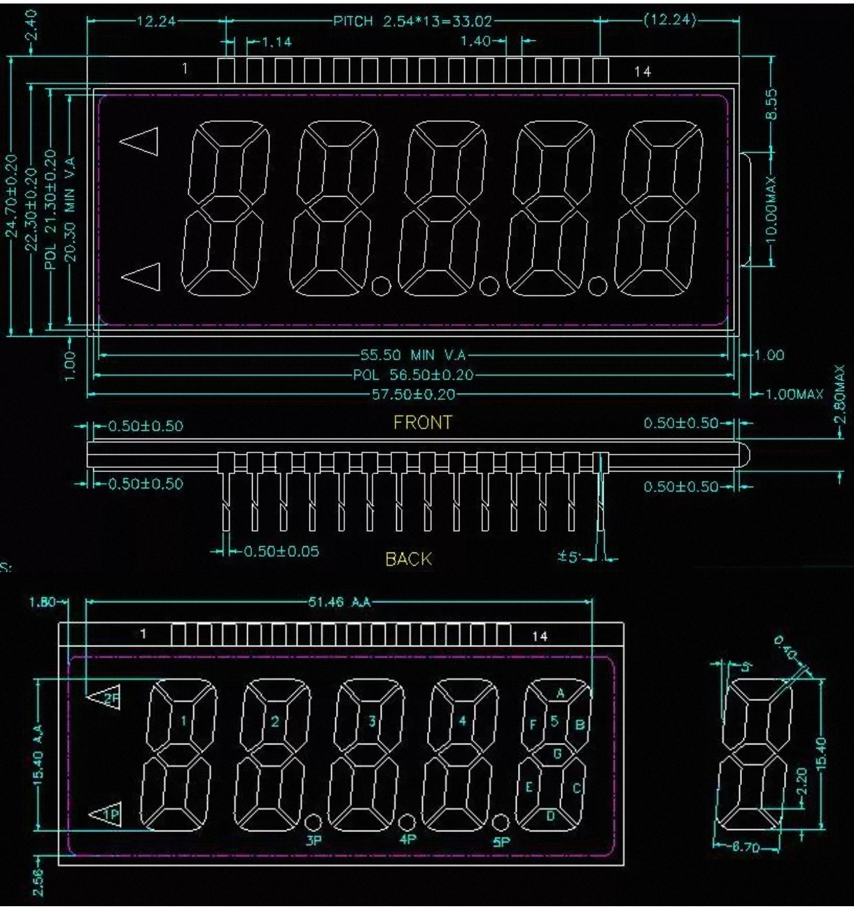

# 说明

本工程适用于微瑞能源的RN8211B（A4:互感器版）开发板。

# 晶振

低速晶振：32.768K

# 外设

## EEPROM

RN8211B(C)内置 32K EEPROM，正常启动时，其地址为0x08000000.

本工程采用[FlashDB](https://github.com/armink/FlashDB.git)管理EEPROM,将EEPROM分为两个区(具体见[fal_cfg.h](fal_cfg.h)),其说明如下:

| 偏移       | 长度       | 类型       | 用途                   |
| ---------- | ---------- | ---------- | ---------------------- |
| 0x00000000 | 0x00002000 | KV数据库   | 存储设置等             |
| 0x00002000 | 0x00006000 | 时序数据库 | 存储时序数据，如电量。 |

## LCD

RN8211B(C) 支持段码屏幕。可支持多种模式。

开发板自带5位8字段码屏，共40段，共占用4个LCD COM脚及10个LCD SEG脚。其中LCD SEG脚为复用引脚，需要将功能设置为LCD。

本工程中采用8COM模式(COM引脚采用COM0~COM3，SEG引脚采用SEG20~SEG29),对应的显示缓冲为LCD_BUF16~LCDBUF25。

驱动实现见[drv_lcd.h](drv_lcd.h)与[drv_lcd.cpp](drv_lcd.cpp)。

# 栈

由于RN8211B的内存非常小,所以各任务栈均非常小，一定要注意栈的使用。

## MSP

main函数与中断函数使用的栈。

由链接脚本与启动汇编决定。

若未特殊说明，一般分配768字节(MDK见startup*.s,GCC见链接脚本)。

中断函数中不要进行复杂的操作，可用于简单标志检查与设定。

## PSP

psp由任务使用，下列为各个任务的栈。

### 空闲任务(idle)

若未特殊说明，一般为最小任务栈大小（一般是128字（512字节））。

空闲任务中不要进行复杂的操作，可用于简单标志检查与设定。

### 软件定时器任务(Timer)

若未特殊说明，一般是192字（768字节）。

空闲任务中不要进行复杂的操作，可用于简单的定时任务。

### HBox

若未特殊说明，一般是512字（2048字节）。

HBox为主任务，可进行相对复杂的操作（尤其对栈消耗较大的函数）。

**注意：HBox任务是动态创建的，需要使堆空间(内存剩余量)足够。**
